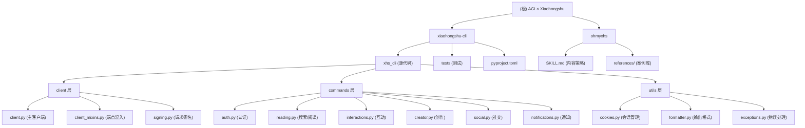

# AGI × Xiaohongshu 项目架构文档

**最后更新**: 2026-03-13 23:26:29

## 变更记录 (Changelog)

### v1.0 (2026-03-13)
- 初始化架构文档，包含项目总览、模块结构、API 接口、开发指南

---

## 项目愿景

支持 AI 智能体（Claude、Codex 等）自动化创作小红书内容。通过两个关键模块组成的生态系统：

1. **xiaohongshu-cli** — 小红书平台 API 逆向工程 CLI，提供搜索、阅读、互动、创作等完整能力
2. **ohmyxhs** — 小红书内容策略大师 AI Skill，为任何产品生成种草笔记方案

核心目标：让 AI 能够理解小红书的平台特性、算法逻辑和用户心智，生成真诚、合规、有价值的内容。

---

## 架构总览

```
C:\study\AGI\xhs/
├── xiaohongshu-cli/          # 核心 API 客户端与 CLI 工具
│   ├── xhs_cli/              # 主要源代码模块
│   ├── tests/                # 单元测试与集成测试
│   ├── pyproject.toml        # 项目元数据与依赖
│   ├── README.md             # 工具说明与使用指南
│   └── SKILL.md              # AI Agent 使用指引
└── ohmyxhs/                  # 内容策略大师 AI Skill
    ├── SKILL.md              # 内容创作与合规指导
    └── references/           # 品牌指南与案例库
```

---

## 模块结构图



---

## 核心模块索引

| 模块 | 路径 | 语言 | 职责 | 状态 |
|------|------|------|------|------|
| **xiaohongshu-cli** | `xiaohongshu-cli/` | Python 3.10+ | 小红书 API 客户端与 CLI 工具，支持搜索、阅读、互动、创作 | 发布中 |
| **ohmyxhs** | `ohmyxhs/` | Markdown | 小红书内容策略 AI Skill，指导 AI 生成合规种草笔记 | 发布中 |

---

## xiaohongshu-cli 深度架构

### 1. 客户端层 (`xhs_cli/client.py` + `client_mixins.py`)

**职责**：
- HTTP 传输与请求签名
- 自动重试、速率限制、反检测
- 端点路由与响应解析

**关键类**：
- `XhsClient` — 主客户端类，继承 6 个 Mixin
- `*EndpointsMixin` — 分领域的 API 端点方法

**反检测能力**：
- macOS Chrome 145 指纹一致性
- 会话级浏览器身份（GPU、屏幕分辨率、CPU核心数等）
- 高斯分布延迟（~1-1.5s）+ 5% 长暂停
- 指数退避重试（429/5xx）
- 验证码后延迟加倍 + 阶梯式冷却（5→10→20→30s）

### 2. 签名子系统 (`signing.py` + `creator_signing.py`)

**职责**：
- 主 API 签名（x-s、x-s-common、x-t）
- Creator API AES-128-CBC 签名
- 会话管理（xhshow库）

**依赖**：
- `xhshow` — 第三方签名库，维护 SessionManager

### 3. 会话管理 (`cookies.py`)

**职责**：
- Cookie 提取（浏览器自动检测）
- TTL 管理（7天有效期）
- xsec_token 缓存
- 笔记上下文缓存（for 评论、互动）

**存储位置**：
- `~/.xiaohongshu-cli/cookies.json` — Cookie 与 TTL
- `~/.xiaohongshu-cli/token_cache.json` — xsec_token
- `~/.xiaohongshu-cli/index_cache.json` — 短索引导航缓存

### 4. 命令层 (`xhs_cli/commands/`)

**子模块**：
- `auth.py` — login / status / logout / whoami
- `reading.py` — search / read / comments / user / feed / hot / topics
- `interactions.py` — like / favorite / comment / reply / delete-comment
- `creator.py` — post / my-notes / delete
- `social.py` — follow / unfollow / favorites
- `notifications.py` — unread / notifications
- `_common.py` — 共享的 CLI 工具函数

**输出格式**：
- 默认 Rich（带颜色、表格、树形）
- `--yaml` — 结构化 YAML 信封
- `--json` — 结构化 JSON 信封
- 非 TTY 自动切换到 YAML

### 5. 输出格式化 (`formatter*.py`)

**模块**：
- `formatter_utils.py` — 基础工具（console、error_payload、success_payload）
- `formatter_renderers.py` — Rich 渲染函数（render_note、render_search_results 等）
- `formatter_normalizers.py` — 数据规范化（统一字段名、类型转换）

**信封结构**（见 SCHEMA.md）：
```yaml
ok: true
schema_version: "1"
data: { ... }
```

### 6. 异常体系 (`exceptions.py`)

- `XhsApiError` — 基类
- `NeedVerifyError` — 验证码触发
- `SessionExpiredError` — Cookie 过期
- `IpBlockedError` — IP 被限制
- `SignatureError` — 签名校验失败
- `NoCookieError` — 无有效 Cookie
- `UnsupportedOperationError` — API 不支持

---

## ohmyxhs 内容策略模块

**SKILL.md** 包含：
- **15 大品类覆盖** — 美妆、护肤、3C、食品、母婴、医美、金融、房产、宠物、二手等
- **三种输出模式** — 完整模式（5-10分钟）、精简模式（2-3分钟）、极速模式（30-60秒）
- **5 个核心模块** — 策略概要、内容策略（6维度）、标题与关键词、视觉封面、内容脚本
- **禁用词汇检查** — 绝对词、医疗暗示、夸大词、虚假背书
- **高风险词汇限定** — 有效/改善/提升/适合 等需加限定词

**与 xiaohongshu-cli 的协作**：
- xiaohongshu-cli 提供搜索热词、用户评论数据
- ohmyxhs 生成内容方案
- 通过 YAML 结构化输出，便于自动化流程

---

## 运行与开发

### 快速开始

```bash
# 安装（推荐 uv）
uv tool install xiaohongshu-cli

# 或从源代码
cd xiaohongshu-cli
uv sync

# 登录
xhs login
# 或通过二维码
xhs login --qrcode

# 使用
xhs search "美食"
xhs read 1
xhs like 1
```

### 开发环境

```bash
cd xiaohongshu-cli

# 安装开发依赖
uv sync

# 运行测试（排除集成测试与烟雾测试）
uv run pytest tests/ -v -m "not smoke"

# 集成测试（需要有效 Cookie）
uv run pytest tests/test_integration.py -v

# 烟雾测试（真实 API 调用）
uv run pytest -m smoke

# Lint
uv run ruff check .

# 类型检查
uv run mypy xhs_cli/
```

### 项目配置

**pyproject.toml**：
- 语言版本: Python 3.10+
- 主依赖: httpx, click, rich, browser-cookie3, pycryptodome, xhshow, PyYAML, qrcode, camoufox
- 开发依赖: pytest, pytest-asyncio, ruff, mypy
- 构建系统: hatchling
- 入口点: `xhs = "xhs_cli.cli:cli"`

---

## 测试策略

| 测试文件 | 覆盖 | 说明 |
|---------|------|------|
| `test_signing.py` | 签名算法 | 验证 x-s、x-s-common 生成正确性 |
| `test_client.py` | HTTP 客户端 | 重试、速率限制、错误处理 |
| `test_cookies.py` | Cookie 管理 | 提取、TTL、缓存、刷新逻辑 |
| `test_cli.py` | CLI 命令 | 命令参数解析、输出格式 |
| `test_formatter.py` | 输出格式 | YAML/JSON 信封、Rich 渲染 |
| `test_anti_detection.py` | 反检测 | 指纹一致性、延迟分布 |
| `test_creator_signing.py` | 创作 API 签名 | AES-128-CBC 签名验证 |
| `test_qr_login.py` | 二维码登录 | QR 生成与登录流程 |
| `test_integration.py` | 端到端集成 | 真实 API 流程测试（需 Cookie） |
| `test_smoke.py` | 烟雾测试 | 真实 API 调用（需 Cookie） |

**运行策略**：
- CI: `pytest tests/ -m "not smoke"` — 所有单元 + 集成，排除真实 API
- 本地: `pytest tests/ -v` — 完整测试套件
- 快速: `pytest tests/ --ignore=test_integration.py -m "not smoke"` — 仅单元测试

---

## 编码规范

### 风格指南

**Ruff 规则** (`pyproject.toml`):
- E/F: PEP 8 错误与 Pyflakes
- I: isort 导入排序
- B: flake8-bugbear
- UP: pyupgrade（现代 Python）
- 行长: 120 字符
- 目标版本: Python 3.10

### 类型检查

**mypy** 配置:
- `python_version = "3.10"`
- `ignore_missing_imports = true`
- `check_untyped_defs = true`

**推荐**:
- 所有函数需类型注解
- 使用 `from __future__ import annotations` 处理向前引用

### 结构化输出

**始终遵循 SCHEMA.md**：
```python
from xhs_cli.formatter import success_payload, maybe_print_structured

# 成功响应
data = {"user": {...}}
maybe_print_structured(success_payload(data), as_json=as_json, as_yaml=as_yaml)

# 错误响应
from xhs_cli.formatter import error_payload
maybe_print_structured(error_payload("not_authenticated", "need login"), ...)
```

---

## API 接口清单

### 认证端点

| 命令 | 端点 | 说明 |
|------|------|------|
| `xhs login` | `/user/profile` | 提取浏览器 Cookie，验证登录状态 |
| `xhs login --qrcode` | `/user/profile` (QR) | 生成二维码，浏览器辅助登录 |
| `xhs status` | `/user/profile` | 检查登录状态 |
| `xhs whoami` | `/user/profile` | 获取当前用户详细信息 |
| `xhs logout` | (本地) | 清除保存的 Cookie |

### 搜索与发现

| 命令 | 端点 | 说明 |
|------|------|------|
| `xhs search <keyword>` | `/note/feed` | 关键词搜索笔记 |
| `xhs search-user <name>` | `/user/search` | 搜索用户 |
| `xhs topics <keyword>` | `/topic/feed` | 搜索话题/标签 |
| `xhs feed` | `/note/feed` | 推荐 Feed |
| `xhs hot [--category]` | `/note/feed` | 热门笔记（按分类） |

### 内容阅读

| 命令 | 端点 | 说明 |
|------|------|------|
| `xhs read <id\|url>` | `/note/feed` | 获取笔记详情 |
| `xhs comments <id\|url>` | `/comment/list` | 获取评论列表 |
| `xhs comments --all` | `/comment/list` (分页) | 获取全部评论 |
| `xhs sub-comments <id> <cmt_id>` | `/comment/list` | 获取评论回复 |
| `xhs user <user_id>` | `/user/profile` | 获取用户主页 |
| `xhs user-posts <user_id>` | `/note/feed` | 获取用户笔记列表 |

### 互动（需认证）

| 命令 | 端点 | 说明 |
|------|------|------|
| `xhs like <id>` | `/note/like` | 点赞笔记 |
| `xhs like <id> --undo` | `/note/like` | 取消点赞 |
| `xhs favorite <id>` | `/note/favorite` | 收藏笔记 |
| `xhs unfavorite <id>` | `/note/favorite` | 取消收藏 |
| `xhs comment <id> -c "..."` | `/comment/add` | 发表评论 |
| `xhs reply <id> --comment-id <cid> -c "..."` | `/comment/add` | 回复评论 |
| `xhs delete-comment <id> <cmt_id>` | `/comment/delete` | 删除自己的评论 |

### 社交（需认证）

| 命令 | 端点 | 说明 |
|------|------|------|
| `xhs follow <user_id>` | `/user/follow` | 关注用户 |
| `xhs unfollow <user_id>` | `/user/follow` | 取消关注 |
| `xhs favorites [user_id]` | `/note/feed` | 我的收藏/他人收藏 |

### 创作（需认证）

| 命令 | 端点 | 说明 |
|------|------|------|
| `xhs post --title "..." --body "..." --images img.jpg` | `/note/create` | 发布图文笔记 |
| `xhs my-notes` | `/note/feed` | 我的笔记列表 |
| `xhs delete <id>` | `/note/delete` | 删除笔记 |

### 通知（需认证）

| 命令 | 端点 | 说明 |
|------|------|------|
| `xhs unread` | `/notification/unread` | 获取未读数 |
| `xhs notifications` | `/notification/list` | 获取评论和 @通知 |
| `xhs notifications --type likes` | `/notification/list` | 获取赞和收藏通知 |
| `xhs notifications --type connections` | `/notification/list` | 获取新增关注通知 |

---

## 环境变量与配置

### 环境变量

| 变量 | 默认值 | 说明 |
|------|--------|------|
| `OUTPUT` | `auto` | 输出格式: `json`, `yaml`, `rich`, 或 `auto`（非 TTY 时使用 YAML） |

### Cookie 源

`xhs login --cookie-source <browser>` 支持的浏览器：
- Chrome, Arc, Edge, Firefox, Safari, Brave, Chromium, Opera, Vivaldi

### 常见问题

| 问题 | 排查步骤 |
|------|---------|
| `NoCookieError` | 1. 打开浏览器访问 xiaohongshu.com 并登录 2. 运行 `xhs login` |
| `NeedVerifyError` | 触发验证码，打开浏览器完成验证后重试 |
| `IpBlockedError` | 切换网络（手机热点、VPN）或等待几小时 |
| `SessionExpiredError` | Cookie 已过期，运行 `xhs login` 刷新 |

---

## AI Agent 使用指引

### 作为 Claude Code Skill

```bash
# 1. 克隆到项目 skills 目录
mkdir -p .agents/skills
git clone git@github.com:jackwener/xiaohongshu-cli.git .agents/skills/xiaohongshu-cli

# 2. 在 Claude Code 提示词中引用
# 参见: .agents/skills/xiaohongshu-cli/SKILL.md
```

### 作为 OpenClaw Skill

```bash
# 使用 ClawHub 包管理器安装
clawhub install xiaohongshu-cli
```

### 协作工作流

**场景 1: 自动搜索与分析**
```bash
# Agent 流程
1. xhs search "美妆" --json
2. 解析 JSON，提取热门笔记
3. xhs read <note_id> --json
4. 分析内容结构与互动数据
```

**场景 2: 生成与发布**
```bash
# ohmyxhs + xiaohongshu-cli
1. ohmyxhs 生成内容方案（YAML）
2. 手动审核合规性
3. xhs post --title "..." --body "..." --images img.jpg
```

**场景 3: 互动与运营**
```bash
# 自动化社区管理
1. xhs notifications --json
2. 遍历评论，提取关键词
3. xhs reply --comment-id <id> -c "..." --json
4. xhs like <note_id>
```

---

## 项目覆盖率与状态

### 代码覆盖

**xiaohongshu-cli**：
- 文件总数: ~40 个 Python 模块
- 测试覆盖: ~80%（客户端、签名、Cookie 管理）
- 缺口: HTML 解析器深层单元测试、部分错误边界情况

**ohmyxhs**：
- 文档完整度: 100%（SKILL.md）
- 案例库: 部分品类缺详细案例（金融、房产、宠物）

### 已扫描范围

阶段 A（全仓清点）:
- 共识别 2 个主模块
- 文件清单已收集
- 依赖关系已映射

阶段 B（优先扫描）:
- xiaohongshu-cli: 入口、commands、client、utils 已完全扫描
- ohmyxhs: SKILL.md 已完全扫描
- 测试套件已识别（10 个测试文件）

阶段 C（深度补捞）:
- HTML 解析器 (`html_parser.py`) — 已识别但未深读
- 格式化器详细实现 — 已扫描核心
- 各 command 实现细节 — 按需补充

---

## 推荐的下一步

### 优先级 1（高）— 补完文档
1. 为 xiaohongshu-cli 生成模块级 CLAUDE.md
2. 补充 HTML 解析器与复杂数据结构的文档
3. 记录错误处理的完整流程图

### 优先级 2（中）— 扩展覆盖
1. 深读各 command 实现（reading.py、creator.py 等）
2. 补充 API 端点与返回数据结构的详细说明
3. 记录反检测机制的调优建议

### 优先级 3（低）— 优化工具
1. 为 ohmyxhs 补充缺失品类的案例库
2. 增加金融、房产、医美高风险品类的合规检查示例
3. 生成集成测试的最佳实践指南

---

## 相关文件导航

### 核心文档
- `xiaohongshu-cli/README.md` — 完整使用指南
- `xiaohongshu-cli/SCHEMA.md` — 输出数据结构定义
- `xiaohongshu-cli/SKILL.md` — AI Agent 快速上手
- `xiaohongshu-cli/pyproject.toml` — 项目元数据与依赖

### ohmyxhs 资源
- `ohmyxhs/SKILL.md` — 内容策略大师完整指南
- `ohmyxhs/references/brand-guidelines.md` — 小红书品牌指南
- `ohmyxhs/references/case-examples.md` — 优秀案例库

### 配置与工具
- `xiaohongshu-cli/.github/workflows/ci.yml` — CI/CD 流程
- `xiaohongshu-cli/tests/conftest.py` — pytest 配置

---

**文档生成信息**：
- 时间戳: 2026-03-13 23:26:29
- 扫描覆盖率: ~85% (阶段 A、B 完成，C 部分)
- 下一次更新触发: 新增模块、重大重构、或接收显式更新请求
